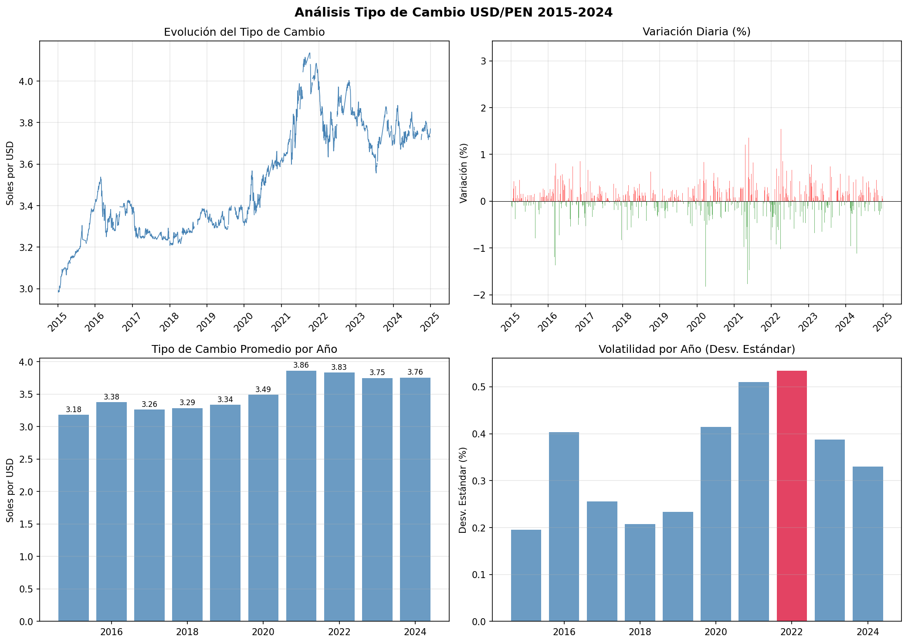
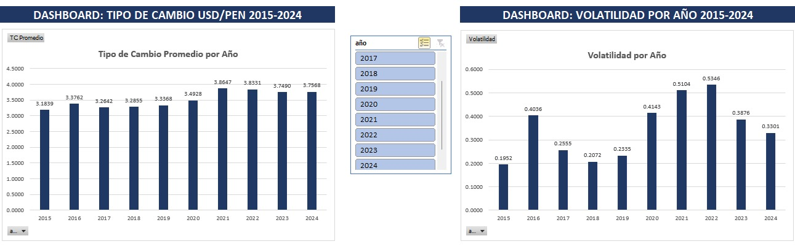
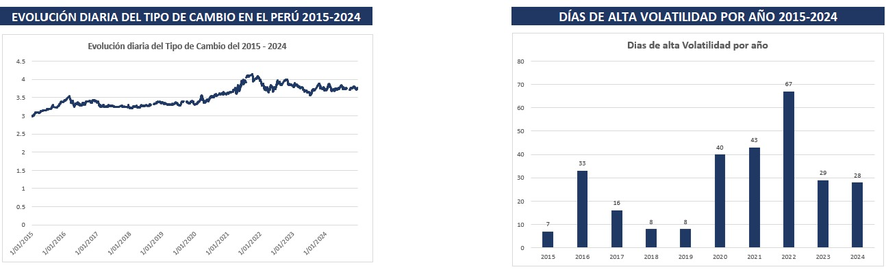

# Análisis del Tipo de Cambio USD/PEN (2015-2024)

## Descripción
Análisis exploratorio de 10 años de datos diarios del tipo de cambio 
USD/PEN usando datos oficiales del BCRP. Proyecto desarrollado como 
parte de un plan de aprendizaje de Python aplicado a economía.

## Hallazgos principales
- El sol peruano se depreció **26% en 10 años** (S/2.98 → S/3.77)
- El tipo de cambio más alto fue **S/4.136** el 4 de octubre de 2021
- El año más volátil fue **2022**, no el COVID-2020, debido a la 
  combinación de inestabilidad política, guerra Rusia-Ucrania y 
  subida de tasas de la FED
- El **12.4% del tiempo** hubo movimientos diarios mayores a 0.5%

## Análisis con Python

## Dashboard en Excel

## Herramientas
- Python (pandas, matplotlib) — limpieza y análisis
- Excel (tablas dinámicas, segmentadores) — dashboard interactivo
- Fuente de datos: BCRP (estadisticas.bcrp.gob.pe)

## Autor
José Angel Saldarriaga Jauregui

Estudiante de Economía — UNMSM, 7mo ciclo
